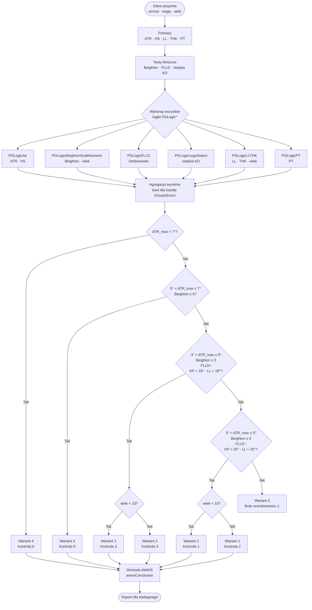

# AWWS — Algorytm wnioskowania o postawie ciała dziecka

## Spis treści

1. [Cel i kontekst](#1-cel-i-kontekst)
2. [Parametry wejściowe](#2-parametry-wejściowe)
3. [Grupy wynikowe (GroupsEnum)](#3-grupy-wynikowe-groupsenum)
4. [Logiki składowe (PGLogic*)](#4-logiki-składowe-pglogic)
   - [PGLogicAtr](#pglogicatr--kąt-atr-i-hs)
   - [PGLogicBeightonScaleNumeric](#pglogicbeightonscalenumeric--skala-beightona)
   - [PGLogicFLLD](#pglogicflld--test-derbolowskiego-flld)
   - [PGLogicLegsStatics](#pglogiclegsstatics--statyka-kończyn-dolnych)
   - [PGLogicLLTHK](#pglogicllthk--lordoza-i-kifoza)
   - [PGLogicPT](#pglogicpt--pochylenie-miednicy-pt)
   - [PGLogicPatientAge / Height / Weight](#pglogicpatientage--height--weight)
5. [Wnioskowanie PiLS](#5-wnioskowanie-pils)
6. [Przepływ algorytmu AWWS](#6-przepływ-algorytmu-awws)
7. [Rekomendacje postępowania](#7-rekomendacje-postępowania)
8. [Powiązane pliki źródłowe](#8-powiązane-pliki-źródłowe)

---

## 1. Cel i kontekst

**AWWS** (Algorytm Wnioskowania o Wadach i Skoliozie) to silnik diagnostyczny stosowany w badaniu przesiewowym postawy ciała dziecka. Jego celem jest:

- klasyfikacja dziecka do jednej lub wielu **grup ryzyka** (skolioza idiopatyczna, zaburzenia statyki, wady płaszczyzny strzałkowej),
- wyznaczenie **wariantu postępowania PiLS** (Postępowanie i Leczenie Skoliozy),
- wygenerowanie **wniosku AWWS** z zaleceniem dla badającego.

Algorytm działa poprzez zestaw niezależnych **logik składowych** (`PGLogic*`), z których każda ocenia jeden pomiar lub grupę pomiarów względem wszystkich grup wynikowych. Wyniki logik są następnie agregowane w `EstimateParams()` w `AwwsformUserControl`.

---

## 2. Parametry wejściowe

Parametry przekazywane są w słowniku `Dictionary<ParametersNamesEnum, object>`.

| Parametr (`ParametersNamesEnum`) | Typ | Opis |
|----------------------------------|-----|------|
| `ATR` | `int` | Kąt rotacji tułowia (Angle of Trunk Rotation) mierzony skoliometrem [°] |
| `HS` | `int` | Hump Score — asymetria grzbietu mierzona siatką punktową |
| `BEIGHTON` | `int` | Wynik skali Beightona (0–9) — ocena wiotkości stawowej |
| `FLLD_POSITIVE` | `bool` | Test Derbolowskiego dodatni (nierówność funkcjonalna kończyn dolnych) |
| `FLLD_NEGATIVE` | `bool` | Test Derbolowskiego ujemny |
| `FLLD_NEUTRAL` | `bool` | Wynik testu Derbolowskiego neutralny |
| `LEGSSTAT_DISTURBED` | `bool` | Zaburzona statyka kończyn dolnych |
| `LEGSSTAT_CORRECT` | `bool` | Prawidłowa statyka kończyn dolnych |
| `LL` | `int` | Lordoza lędźwiowa [°] |
| `THK` | `int` | Kifoza piersiowa (Thoracic Kyphosis) [°] |
| `PT` | `int` | Pochylenie miednicy (Pelvic Tilt) [°] |
| `AGE` | `int` | Wiek pacjenta [lata] |
| `HEIGHT` | `double` | Wzrost pacjenta [cm] |
| `WEIGHT` | `double` | Masa ciała pacjenta [kg] |

---

## 3. Grupy wynikowe (GroupsEnum)

Każda logika składowa zwraca wartość `bool` dla każdej z poniższych grup. Wynik `true` oznacza, że dany parametr **jest zgodny** z kryterium tej grupy.

| Wartość `GroupsEnum` | Opis kliniczny |
|----------------------|----------------|
| `Healthy` | Dziecko zdrowe — brak odchyleń od normy |
| `StaticsDisordersOfTheLowerLimbs` | Zaburzenia statyki kończyn dolnych |
| `FlatBack` | Plecy płaskie (zmniejszona lordoza i kifoza) |
| `KyphoticBack` | Plecy kifotyczne (nadmierna kifoza piersiowa) |
| `LordoticBack` | Plecy lordotyczne (nadmierna lordoza lędźwiowa) |
| `IS_LowRiskGroup` | Skolioza idiopatyczna — grupa niskiego ryzyka |
| `IS_MediumRiskGroup` | Skolioza idiopatyczna — grupa średniego ryzyka |
| `IS_HighRiskGroup` | Skolioza idiopatyczna — grupa wysokiego ryzyka |

---

## 4. Logiki składowe (PGLogic*)

Każda klasa dziedziczy po `PGLogicBase` i implementuje `IPGLogic`. Metoda `Perform()` z klasy bazowej iteruje po wszystkich wartościach `GroupsEnum` i wywołuje zarejestrowaną lambdę dla każdej grupy.

### PGLogicAtr — kąt ATR i HS

Źródło: `ORT100.UserControls\SurveyForms\Algorythms\Logics\PGLogicAtr.cs`  
Parametry: `ATR`, `HS`

| Grupa | Warunek |
|-------|---------|
| `Healthy` | `ATR ≤ 2` AND `HS < 4` |
| `StaticsDisordersOfTheLowerLimbs` | `ATR ≤ 2` AND `HS < 4` |
| `FlatBack` | `ATR ≤ 2` AND `HS < 4` |
| `KyphoticBack` | `ATR ≤ 2` AND `HS < 4` |
| `LordoticBack` | `ATR ≤ 2` AND `HS < 4` |
| `IS_LowRiskGroup` | `(ATR ≥ 3` AND `ATR ≤ 4)` OR `(HS ≥ 4` AND `HS ≤ 5)` |
| `IS_MediumRiskGroup` | `(ATR ≥ 5` AND `ATR ≤ 6)` OR `(HS ≥ 6` AND `HS ≤ 7)` |
| `IS_HighRiskGroup` | `ATR ≥ 7` OR `HS ≥ 8` |

---

### PGLogicBeightonScaleNumeric — skala Beightona

Źródło: `ORT100.UserControls\SurveyForms\Algorythms\Logics\PGLogicBeightonScaleNumeric.cs`  
Parametry: `BEIGHTON`, `AGE`

| Grupa | Warunek |
|-------|---------|
| `Healthy` | (wiek 5–15 lat AND Beighton ≥ 4) OR (wiek 16–18 AND Beighton ≥ 3) |
| `IS_LowRiskGroup` | (wiek 5–15 lat AND Beighton ≥ 5) OR (wiek 16–18 AND Beighton ≥ 4) |
| `IS_MediumRiskGroup` | (wiek 5–15 lat AND Beighton ≥ 5) OR (wiek 16–18 AND Beighton ≥ 4) |
| `IS_HighRiskGroup` | zawsze `true` (warunek nadrzędny — decydują inne logiki) |
| `StaticsDisordersOfTheLowerLimbs`, `FlatBack`, `KyphoticBack`, `LordoticBack` | zawsze `true` |

---

### PGLogicFLLD — test Derbolowskiego (FLLD)

Źródło: `ORT100.UserControls\SurveyForms\Algorythms\Logics\PGLogicFLLD.cs`  
Parametry: `FLLD_POSITIVE`, `FLLD_NEGATIVE`

| Grupa | Warunek |
|-------|---------|
| `StaticsDisordersOfTheLowerLimbs` | `FLLD_POSITIVE = true` |
| `IS_LowRiskGroup` | `FLLD_POSITIVE = true` |
| `IS_MediumRiskGroup` | `FLLD_POSITIVE = true` |
| `Healthy` | `FLLD_NEGATIVE = true` |
| `FlatBack`, `KyphoticBack`, `LordoticBack`, `IS_HighRiskGroup` | zawsze `true` |

---

### PGLogicLegsStatics — statyka kończyn dolnych

Źródło: `ORT100.UserControls\SurveyForms\Algorythms\Logics\PGLogicLegsStatics.cs`  
Parametry: `LEGSSTAT_DISTURBED`, `LEGSSTAT_CORRECT`

| Grupa | Warunek |
|-------|---------|
| `StaticsDisordersOfTheLowerLimbs` | `LEGSSTAT_DISTURBED = true` |
| `Healthy` | `LEGSSTAT_CORRECT = true` |
| Pozostałe grupy | zawsze `true` |

---

### PGLogicLLTHK — lordoza i kifoza

Źródło: `ORT100.UserControls\SurveyForms\Algorythms\Logics\PGLogicLLTHK.cs`  
Parametry: `LL` (lordoza lędźwiowa), `THK` (kifoza piersiowa), `AGE`

| Grupa | Warunek (wiek 6–12) | Warunek (wiek ≥ 13) |
|-------|----------------------|----------------------|
| `Healthy` | `LL ∈ [20, 45]` | `THK ∈ [15, 50]` |
| `FlatBack` | `LL ≤ 15` AND `THK ≤ 15` | `LL < 19` AND `THK ≤ 19` |
| `KyphoticBack` | `LL ≤ 15` AND `THK ≥ 46` | `LL < 19` AND `THK > 50` |
| `LordoticBack` | `LL ≥ 46` AND `THK < 15` | `LL ≥ 50` AND `THK < 19` |
| `StaticsDisordersOfTheLowerLimbs`, `IS_*`, `IS_HighRiskGroup` | zawsze `true` | zawsze `true` |

---

### PGLogicPT — pochylenie miednicy (PT)

Źródło: `ORT100.UserControls\SurveyForms\Algorythms\Logics\PGLogicPT.cs`  
Parametr: `PT`

| Grupa | Warunek |
|-------|---------|
| `Healthy` | `PT ∈ [10, 29]` |
| `FlatBack` | `PT ∈ [5, 20]` |
| `KyphoticBack` | `PT ∈ [10, 30]` |
| `LordoticBack` | `PT ∈ [20, 40]` |
| `IS_LowRiskGroup` | `PT ∈ [10, 30]` |
| `IS_MediumRiskGroup` | `PT ∈ [10, 30]` |
| `IS_HighRiskGroup` | zawsze `true` |
| `StaticsDisordersOfTheLowerLimbs` | zawsze `true` |

---

### PGLogicPatientAge / Height / Weight

Źródła: `PGLogicPatientAge.cs`, `PGLogicPatientHeight.cs`, `PGLogicPatientWeight.cs`  
Parametry: `AGE`, `HEIGHT`, `WEIGHT`

Logiki pomocnicze — dla wszystkich grup zwracają `true`. Służą do dostarczenia danych antropometrycznych do pozostałych logik (wiek, wzrost, masa ciała wpływają na progi w innych logikach, np. `PGLogicLLTHK`, `PGLogicBeightonScaleNumeric`).

---

## 5. Wnioskowanie PiLS

Po wyznaczeniu wariantu przez `EstimateParams()` stosowany jest algorytm **PiLS** (Postępowanie i Leczenie Skoliozy).

### Wyznaczenie wariantu i kontroli

Priorytety wariantów (od najwyższego):

| Priorytet | Warunek | Wariant PiLS | Kontrola |
|-----------|---------|:------------:|:--------:|
| 1 (najwyższy) | `ATR_max > 7°` | 4 | 6 |
| 2 | `5° < ATR_max ≤ 7°` AND `Beighton ≥ 6` | 3 | 5 |
| 3 | `3° < ATR_max ≤ 5°` AND `Beighton ≤ 5` AND `FLLD+` AND `KP < 19°` AND `LL < 19°` | 2 | 3 (wiek < 10) / 4 (wiek ≥ 10) |
| 4 (najniższy) | `3° < ATR_max ≤ 5°` AND `Beighton ≤ 5` AND `FLLD−` AND `KP > 20°` AND `LL > 20°` | 1 | 1 (wiek < 10) / 2 (wiek ≥ 10) |

> `ATR_max = max(|aMin|, |aMax|)` — maksymalna wartość bezwzględna kąta ATR zmierzonego w trakcie badania.

### Opis wariantów PiLS (`PiLSparams`)

| Wariant | Opis |
|---------|------|
| 1 | Niewielka asymetria grzbietu (ATR 3–5°), brak nierówności funkcjonalnej kończyn dolnych, test Derbolowskiego ujemny, kifoza i lordoza w normie (20–45°), Beighton ≤ 5/9 |
| 2 | Niewielka asymetria grzbietu (ATR 3–5°), nierówność funkcjonalna kończyn dolnych LUB zaburzenia statyki stawów / zmniejszona kifoza lub lordoza (< 19°), Beighton ≤ 5/9 |
| 3 | Asymetria grzbietu (ATR 5–6°), Beighton ≥ 6/9 |
| 4 | Asymetria grzbietu ATR ≥ 7° |

### Zalecenia kontroli (`PiLSclue`)

| Klucz kontroli | Treść |
|:--------------:|-------|
| 1 | Wiek 3–9 lat: kontrola za 12 miesięcy |
| 2 | Wiek 10–12 lat: kontrola za 6 miesięcy |
| 3 | Wiek 3–9 lat: kontrola za 6 miesięcy |
| 4 | Wiek 10–12 lat: kontrola za 3 miesiące |
| 5 | Kontrola za 3 miesiące |
| 6 | Kontrola co 2 miesiące lub wg zaleceń lekarza |

---

## 6. Przepływ algorytmu AWWS

---

## 7. Rekomendacje postępowania

Wnioski AWWS (`awwsConclusion`) generowane na podstawie wariantu:

| Wariant | Wniosek |
|:-------:|---------|
| 0 | Brak wnioskowania — dane niewystarczające |
| 1 | Dziecko **nie wymaga leczenia** |
| 2 | Kwalifikacja do **profilaktyki czynnej** — gimnastyka korekcyjna lub seria 10 zabiegów rehabilitacyjnych oraz zwiększenie ukierunkowanej aktywności fizycznej |
| 3 | Kwalifikacja do **rehabilitacji wg indywidualnego programu** oraz zwiększenie ukierunkowanej aktywności fizycznej |
| 4 | Kwalifikacja do **RTG kręgosłupa P-A i bocznego** oraz leczenia w poradni ortopedycznej i/lub rehabilitacyjnej wg zaleceń SOSORT/SRS |

---

## 8. Powiązane pliki źródłowe

| Plik | Rola |
|------|------|
| `ORT100.UserControls\SurveyForms\AwwsformUserControl.xaml.cs` | Główny UI — zbiera dane, wywołuje `EstimateParams()`, wyświetla wnioski PiLS/AWWS |
| `ORT100.UserControls\SurveyForms\Algorythms\Logics\PGLogicBase.cs` | Klasa bazowa — silnik wykonujący wszystkie logiki i agregujący `Results` |
| `ORT100.UserControls\SurveyForms\Algorythms\Logics\PGLogicAtr.cs` | Logika ATR + HS |
| `ORT100.UserControls\SurveyForms\Algorythms\Logics\PGLogicBeightonScaleNumeric.cs` | Logika skali Beightona |
| `ORT100.UserControls\SurveyForms\Algorythms\Logics\PGLogicFLLD.cs` | Logika testu Derbolowskiego |
| `ORT100.UserControls\SurveyForms\Algorythms\Logics\PGLogicLegsStatics.cs` | Logika statyki kończyn dolnych |
| `ORT100.UserControls\SurveyForms\Algorythms\Logics\PGLogicLLTHK.cs` | Logika lordozy i kifozy |
| `ORT100.UserControls\SurveyForms\Algorythms\Logics\PGLogicPT.cs` | Logika pochylenia miednicy |
| `ORT100.UserControls\SurveyForms\Algorythms\Logics\PGLogicPatientAge.cs` | Dane wiekowe (pass-through) |
| `OrthoSpine.Shared.Model\GroupsEnum.cs` | Definicja grup wynikowych |
| `OrthoSpine.Shared.Model\ParametersNamesEnum.cs` | Definicja nazw parametrów wejściowych |
| `OrthoSpine.Shared.Model\IPGLogic.cs` | Interfejs logik składowych |
