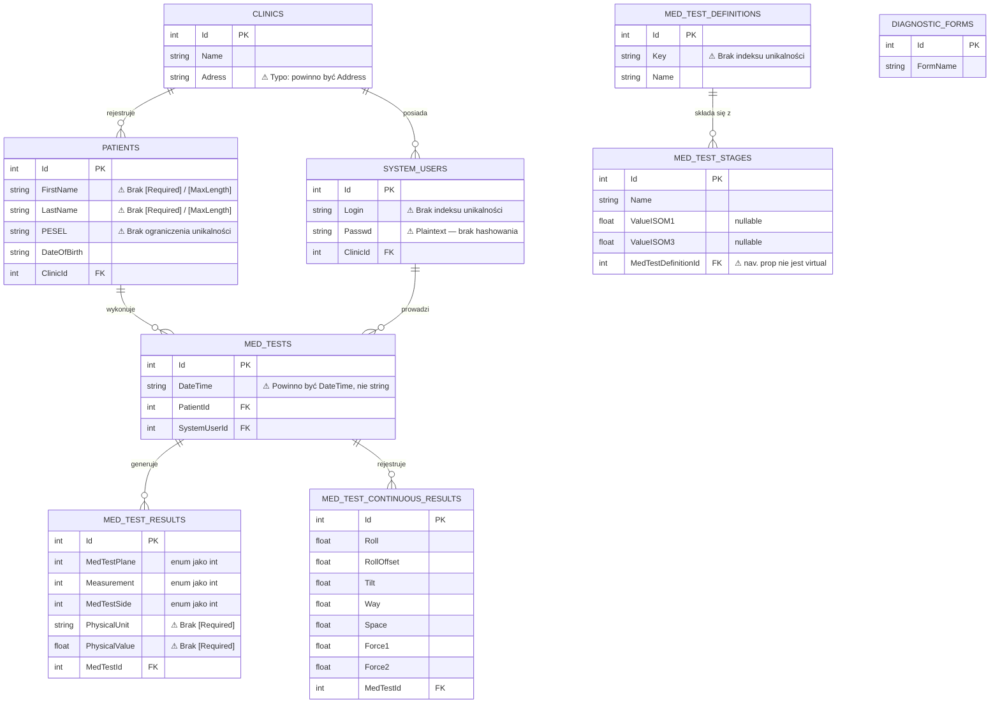

# Database Schema Diagram

Schemat bazy danych aplikacji **OrthoSpine / ORT100** wygenerowany na podstawie analizy architektury EF6.

> Kolumny oznaczone `⚠` wskazują na zidentyfikowane problemy (patrz [EF6_Database_Architecture_Analysis.md](EF6_Database_Architecture_Analysis.md)).

---

## Diagram ERD (Entity Relationship Diagram)

> **Uwaga:** Relacja `MedTest → DiagnosticForm` **nie istnieje w bazie danych** — właściwość nawigacyjna jest oznaczona `[NotMapped]` (problem P5). Tabela `DIAGNOSTIC_FORMS` istnieje jako oddzielna encja bez FK do `MED_TESTS`.

---

## Legenda problemów

| Symbol | Znaczenie |
|--------|-----------|
| `⚠`   | Zidentyfikowany problem architektoniczny lub bezpieczeństwa |
| `PK`  | Klucz główny (Primary Key) |
| `FK`  | Klucz obcy (Foreign Key) |

---

## Podsumowanie relacji

| Relacja | Typ | Kaskada | Uwagi |
|---------|-----|---------|-------|
| `Clinic` → `Patient` | 1 : N | EF domyślna (cascade delete) | FK: `Patient.ClinicId` |
| `Clinic` → `SystemUser` | 1 : N | Nieznana | FK może być niezdefiniowany na encji |
| `Patient` → `MedTest` | 1 : N | EF domyślna | FK: `MedTest.PatientId` |
| `SystemUser` → `MedTest` | 1 : N | EF domyślna | FK: `MedTest.SystemUserId` |
| `MedTestDefinition` → `MedTestStage` | 1 : N | EF domyślna | FK: `MedTestStage.MedTestDefinitionId` |
| `MedTest` → `MedTestResult` | 1 : N | EF domyślna | FK: `MedTestResult.MedTestId` |
| `MedTest` → `MedTestContinuousResult` | 1 : N | EF domyślna | FK: `MedTestContinuousResult.MedTestId` |
| `MedTest` → `DiagnosticForm` | **Brak** | N/A | `[NotMapped]` — relacja nie jest utrwalana ⚠ |
